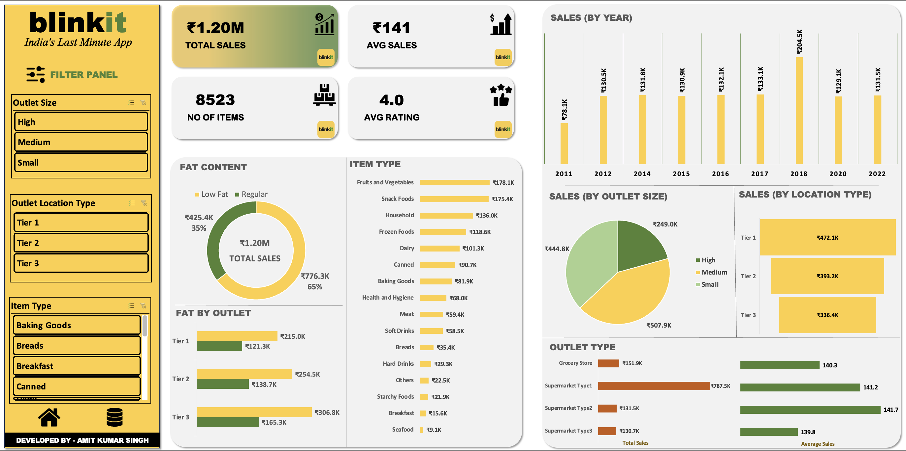

# 📊 Blinkit Sales Analysis Dashboard

## 📌 Project Overview
This project presents an **interactive sales analysis dashboard** for **Blinkit**, built in Microsoft Excel.  
The goal was to conduct a **comprehensive analysis of sales performance, customer satisfaction, and inventory distribution** to identify key insights and opportunities for optimization.

## 🎯 Business Requirement
The dashboard was designed to answer the following business questions:
- What is the overall sales performance of Blinkit?  
- How do customer satisfaction ratings impact sales?  
- What is the distribution of inventory across different categories?  
- Which KPIs can help track performance effectively?  

## 🛠 Tools & Techniques
- **Microsoft Excel** (Dashboard creation)  
- Data Cleaning & Transformation  
- **Pivot Tables & Pivot Charts**  
- Interactive **Slicers & Filters**  
- KPI Visualization  

## 📌 KPI Requirements
The dashboard tracks the following KPIs:
- **Total Sales**  
- **Average Sales**  
- **Number of Items Sold**  
- **Average Customer Ratings**  

## 📊 Dashboard Features
- Interactive pivot charts for exploring sales trends  
- Visual breakdown of inventory distribution  
- KPI cards for quick insights  
- Customer satisfaction analysis  

## 📂 Repository Contents
- `Blinkit_Sales_Dashboard.xlsx` → Main Excel dashboard  
- `Dataset.csv` → Raw/cleaned dataset used  
- `README.md` → Project documentation  

## 📷 Dashboard Preview
 
   

## 🚀 How to Use
1. Download the file `Blinkit_Sales_Dashboard.xlsx`  
2. Open it in **Microsoft Excel (2016 or later recommended)**  
3. Use slicers/filters to explore the data interactively  

## 🔑 Key Insights
- Identified the **top-performing categories** contributing significantly to total sales  
- Observed a correlation between **average ratings and higher sales**  
- Found opportunities for **inventory optimization** to improve supply chain efficiency  

---

## 📌 Conclusion
This dashboard provides a clear view of **Blinkit’s sales performance, customer satisfaction, and inventory trends**.  
It helps stakeholders make **data-driven decisions** and identify opportunities for growth and optimization.  

---

### 👨‍💻 Author
*Created by Amit Kumar Singh*  
📩 Feel free to connect with me on [LinkedIn](https://www.linkedin.com/in/heyamitsingh/)  

---
